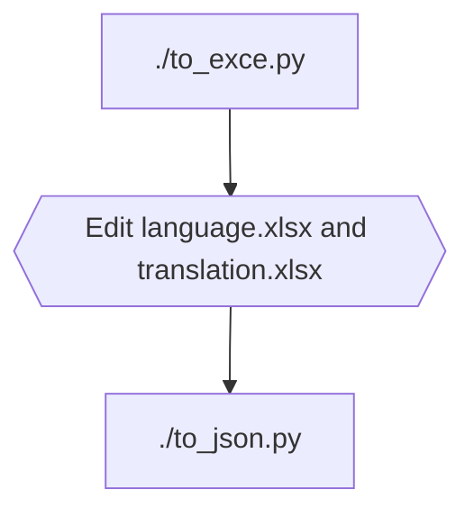

# Emu4Vita++
This is an emulator frontend for the PlayStation Vita, based on the [Libretro API](https://github.com/libretro/libretro-common).

# Download
[Release](https://github.com/noword/Emu4VitaPlus/releases)

The version with log will output more logs in `ux0:data/EMU4VITAPLUS/[core]/Emu4Vita++.log`

# Screenshots


## [overlay and shaders](GRAPHICS.md)

# Supported Cores
Arcade
  - [FinalBurn Lite](https://gitee.com/yizhigai/libretro-fba-lite)
  - [FinalBurn Alpha 2012](https://github.com/libretro/fbalpha2012.git)
  - [FinalBurn Neo](https://github.com/libretro/FBNeo.git)
  - [mame2000](https://github.com/libretro/mame2000-libretro)
  - [mame2003](https://github.com/libretro/mame2003-libretro)
  - [mame2003_plus](https://github.com/libretro/mame2003-plus-libretro)

NES
  - [FCEUmm](https://github.com/libretro/libretro-fceumm)
  - [Nestopia](https://github.com/libretro/nestopia)

SNES
  - [Snes9x 2002](https://github.com/libretro/snes9x2002)
  - [Snes9x 2005](https://github.com/libretro/snes9x2005)
  - [Snes9x 2010](https://github.com/libretro/snes9x2010)

MD
  - [Genesis Plus GX](https://github.com/libretro/Genesis-Plus-GX)
  - [Genesis Plus GX Wide](https://github.com/libretro/Genesis-Plus-GX-Wide.git)
  - [PicoDrive](https://github.com/libretro/picodrive)
  
GBC
  - [Gambatte](https://github.com/libretro/gambatte-libretro)

GBA
  - [gpSP](https://github.com/libretro/gpsp)
  - [VBA Next](https://github.com/libretro/vba-next)
  - [mGBA](https://github.com/libretro/mgba.git)

PCE
  - [Mednafen PCE Fast](https://github.com/libretro/beetle-pce-fast-libretro)
  - [Mednafen SuperGrafx](https://github.com/libretro/beetle-supergrafx-libretro)

PS1
  - [PCSX ReARMed](https://github.com/libretro/pcsx_rearmed)

WSC
  - [Mednafen Wonderswan](https://github.com/libretro/beetle-wswan-libretro)

NGP
  - [Mednafen NeoPop](https://github.com/libretro/beetle-ngp-libretro)
  
DOS(In testing)
  - [DOS SVN](https://github.com/libretro/dosbox-svn)
  - [DOS Pure](https://github.com/libretro/dosbox-pure)

# Pre-Compilation Preparation
## Windows
* Install [msys2](https://www.msys2.org/) or [devkitPro](https://github.com/devkitPro/installer/releases)
#### Enter msys
* Install [vitasdk](https://vitasdk.org/)
* Install cmake, python, ccache (optional)

  ```bash
  pacman -S cmake python python-pip [ccache]
  ```

* Install [openpyxl](https://pypi.org/project/openpyxl/), [pillow](https://pypi.org/project/pillow/)

  ```bash
  pip install openpyxl pillow
  ```

## Linux

Refer to the steps for Windows. If you're using Linux, you should be capable of figuring it out yourself.

# Compilation
```bash
mkdir build
cd build
cmake ../
make
```
Compiling a version with logs:
```bash
mkdir build-debug
cd build-debug
cmake ../ -DWITH_LOG=ON
make
```
Compiling a standalone core vpk:
```bash
mkdir build-gpsp
cd build-gpsp
cmake ../ -DBUILD=gpsp
make
```

# Scripts
## Translate



## Generate shaders
```bash
./compile_shaders.py  # Please search for psp2cgc.exe on the Internet
```

# Paths
## Priviews
The program will automatically search for a `jpg` or `png` image with the same name in the `.previews` directory under the rom directory. If not found, it will search for the screenshots saved in instant state.

## Cheats
The program will be found the .cht file of the same name as rom in the rom directory, the `.cheats` directory under the rom directory, and `ux0:/data/EMU4VITAPLUS/[core]/cheats` directory, whichever is found first.

## Instant State
ux0:/data/EMU4VITAPLUS/[core]/savestates/[rom]

## Save
ux0:/data/EMU4VITAPLUS/[core]/savefiles

## BIOS
ux0:/data/EMU4VITAPLUS/system

copy the corresponding BIOS file to this directory【IMPORTANT】

# Special thanks
[yizhigai](https://gitee.com/yizhigai/Emu4Vita)

[KyleBing](https://github.com/KyleBing/retro-game-console-icons)

TearCrow

The developers of all open source software used in this project