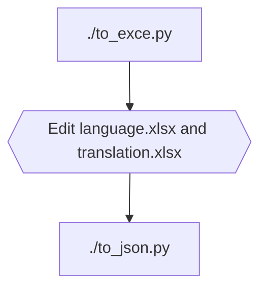

# Translate


```mermaid
graph TD
A[./to_exce.py] --> B{{Edit language.xlsx and translation.xlsx}}
B --> C[./to_json.py]
```

# Generate shaders
```bash
./compile_shaders.py  # Please search for psp2cgc.exe on the Internet
```
